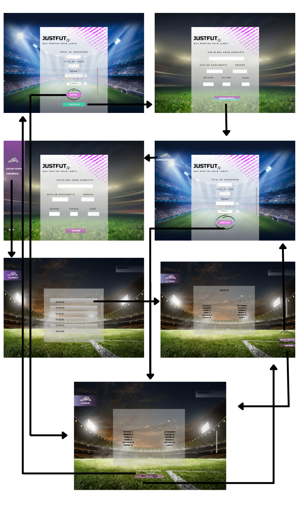
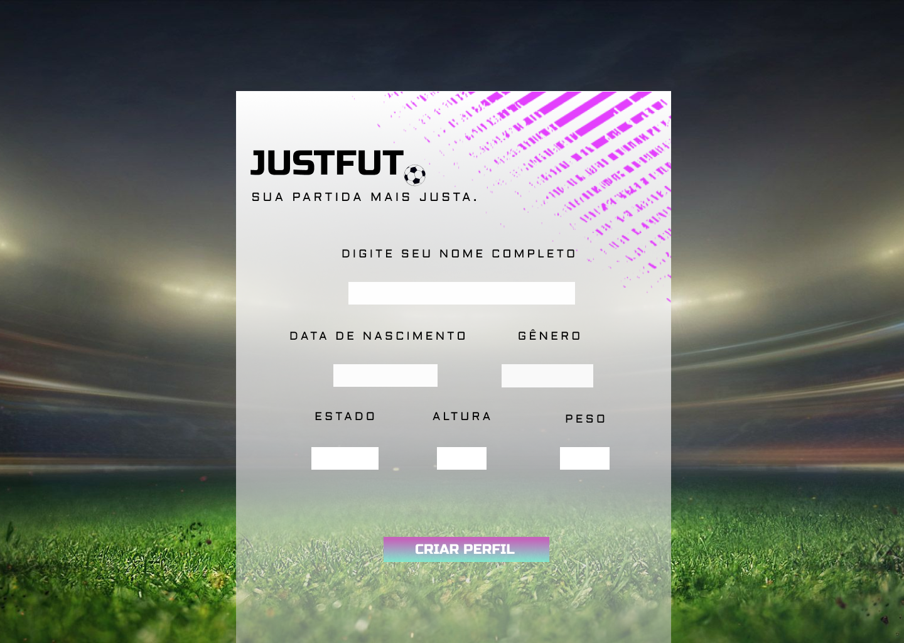
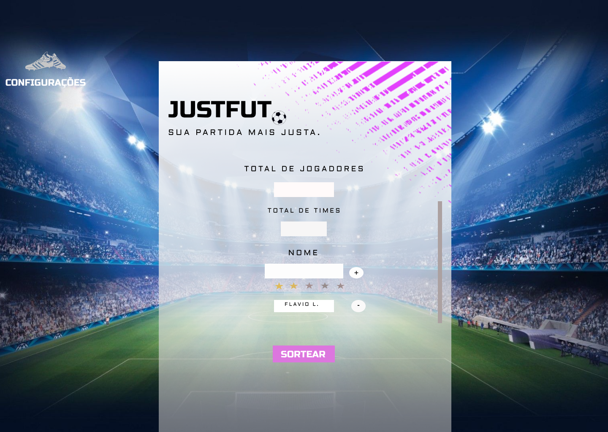
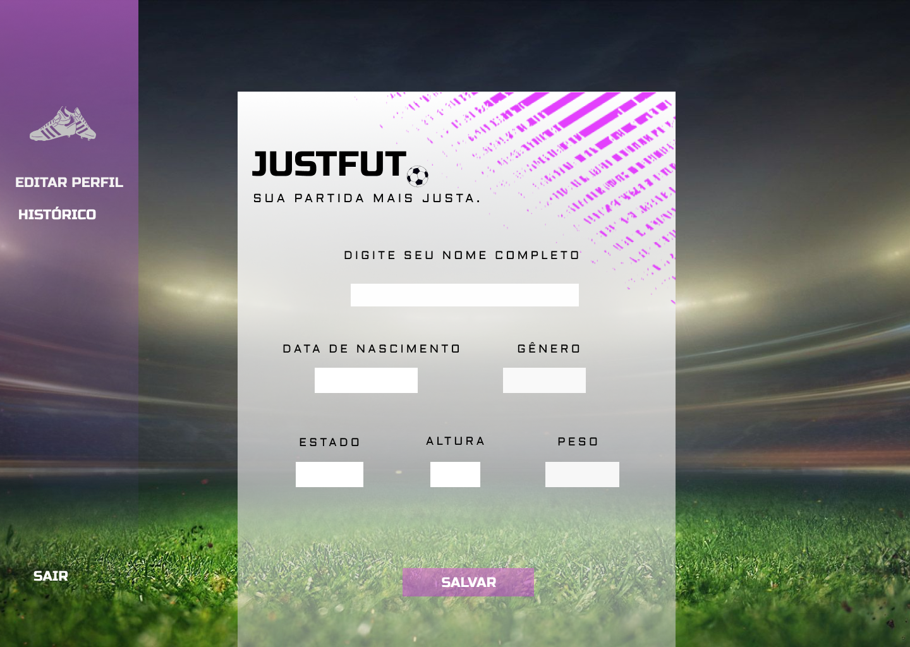
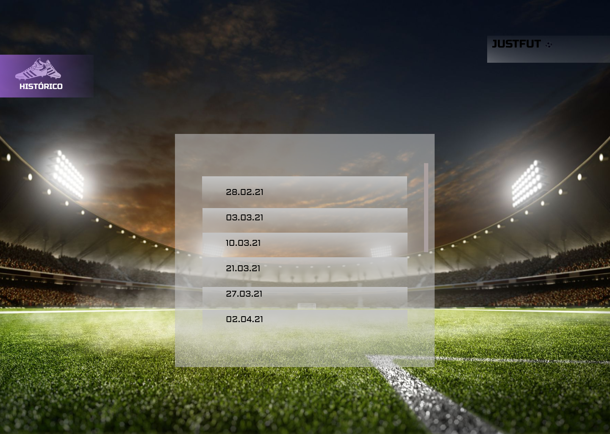
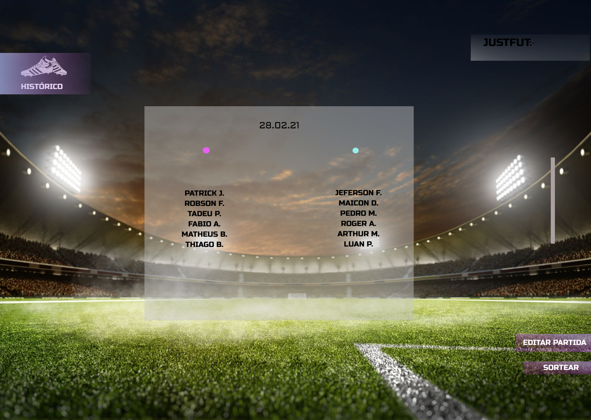
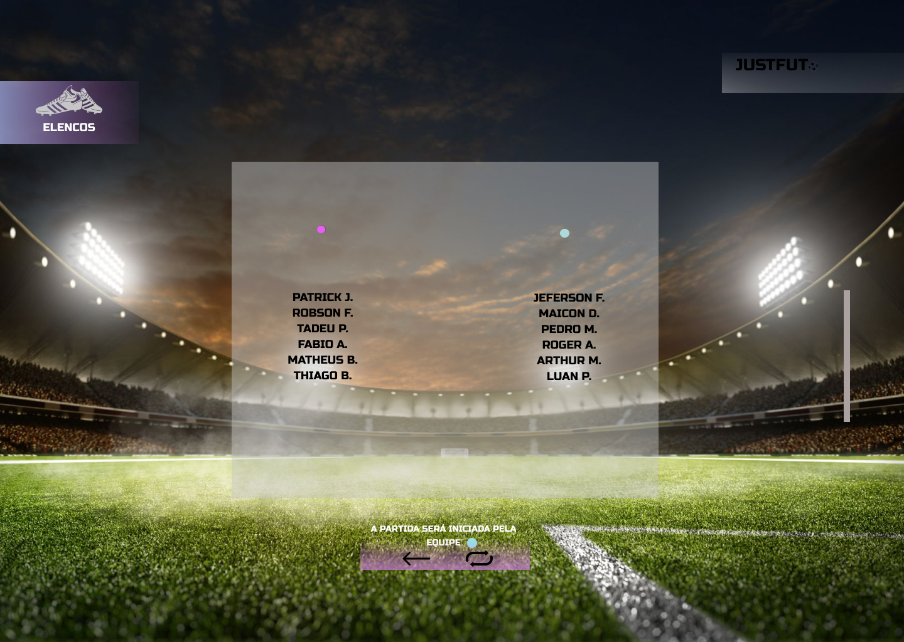

# Projeto de Interface

Os principais objetivos pontuados para a estrutura do projeto foram visando a praticidade, agilidade e acessibilidade. Isso, pensando nos jogadores que não dispõem de muito tempo para as partidas. O site foi planejado para funcionar em dispositivos móveis e em computadores. Além disso, a interface do site possui uma identidade padrão, mas com aspectos singulares no design, que o destaca dos demais sites de divisão de times de futebol.

## User Flow

O esquema expresso na figura 1, representa o fluxo de interação do usuário com o site. Assim que o usuário acessa a plataforma, ele é apresentado a tela inicial (Figura 2), onde ele possui a opção de cadastro ou, então, sortear o time sem se cadastrar.

O usuário que optar por fazer o sorteio sem o cadastro, ao terminar de preencher o formulário será direcionado para a tela de resultado do sorteio (Figura 8), onde ele terá acesso ao resultado do sorteio, com a opção de sortear novamente. 

Caso o usuario decida fazer o cadastro, ele será direcionado a uma tela onde será solicitado que preencha o formulário adicionando seus dados (Figura 3). Ao selecionar "salvar", uma página solicitando que o usuário insira os dados da partida para criar as esquipes será mostrada (Figura 4). A partir de então, o usuário pode sortear o time, sendo direcionado para a tela que contém o resultado do sorteio (Figura 8), bem como, no canto superior esquerdo da tela o usuário tem acesso as configurações (Figura 5), onde ele pode editar o perfil, atualizando os dados que foram registrados anteriormente, ou, optar por visualizar histórico das partidas que pode ser acessado pela data do jogo (Figura 6). Clicando em qualquer data, ele terá acesso aos jogadores da partida da data selecionada (Figura 7), podendo editar e assim ser redirecionado para a tela de criar equipes, onde poderá adicionar ou remover, ou, sortear e ser redirecionado para o resultado do sorteio. Para melhor visualização do projeto, acesse: [Projeto Figma.](https://www.figma.com/file/wbeO453mjVXXIkcTPRyfQA/Projeto-de-interface?node-id=5%3A0.) 

 

(Figura 1 – Fluxo de telas do usuário)

## Wireframes

Como dito no item anterior, as telas do fluxo de sistemas do site serão mais bem detalhadas nas figuras a seguir. A interface do sistema possui uma estrutura muito usual nos aplicativos como descrito nas figuras a seguir.

Tela – Pagina Inicial

> - Cabeçalho – local onde será exposto o nome do site e a frase;
> - Formulário – local onde será preenchido pelo usuário informações sobre os jogadores e a partida;
> - Botões – onde o usuário poderá optar por sorteio ou cadastro no site;
> - Requisitos funcionais: RF-001, RF-002, RF-003, RF-005, RF-006, RF-008.

  

(Figura 2 – Tela Inicial)

Tela – Formulário de cadastro

> - Cabeçalho – local onde será exposto o nome do site e a frase;
> - Formulário – local onde será preenchido pelo usuário suas informações pessoais;
> - Botão – onde o usuário concluirá o cadastro.
> - Requisitos funcionais: RF-002.

  

(Figura 3 – Formulário de cadastro)

Tela – Criar equipes

> - Cabeçalho – local onde será exposto o nome do site e a frase;
> - Formulário – local onde será preenchido pelo usuário informações sobre os jogadores e a partida;
> - Botão – onde o usuário poderá sortear os times;
> - Requisitos funcionais: RF-001, RF-005, RF-006, RF-008.

  

(Figura 4 – Criar equipes)

Tela – Editar perfil

> - Cabeçalho – local onde será exposto o nome do site e a frase;
> - Formulário – local onde será preenchido pelo usuário as informações que deseja alterar;
> - Botões – onde o usuário poderá acessar o histórico, sair ou salvar.
> > - Requisitos funcionais: RF-004.

  

(Figura 5 – Editar perfil)

Tela – Histórico

> - Cabeçalho – local onde será exposto o nome do site;
> - Lista - onde o usuário poderá vizualizar os jogos anteriores, nomes e a quantidade de jogadores.
> - Requisitos funcionais: RF-007, RF-008, RF-009.

  

(Figura 6 – Histórico)

Tela – Resultado do histórico

> - Cabeçalho – local onde será exposto o nome do site;
> - Lista - onde será exibido os times já sorteados em partidas anteriores;
> - Botões – onde o usuário poderá sortear novamente ou editar os nomes que estão na partida;
> - Requisitos funcionais: RF-007, RF-009.

  

(Figura 7 – Resultado do histórico)

Tela – Resultado do sorteio

> - Cabeçalho – local onde será exposto o nome do site;
> - Lista - onde será exibido os times sorteados com sua respectiva cor;
> - Botões – onde o usuário poderá sortear novamente ou voltar para pagina anterior;
> - Requisitos funcionais: RF-007, RF-008.
 

  

(Figura 8– Resultado do sorteio)

