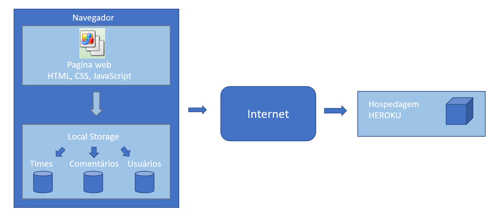

# Arquitetura da Solução

Nesta etapa do projeto vamos apresentar os detalhes técnicos da arquitetura de solução proposta pela equipe, abordando os elementos que fazem parte da solução e do ambiente de hospedagem da solução.

## Diagrama de componentes

A figura 1 abaixo, representa o diagrama que permite a modelagem física de um sistema e a visão dos seus componentes e relacionamentos entre os mesmos.

 (Figura 1 - Arquitetura da Solução) 

A solução implementada conta com os seguintes módulos:
- **Navegador** - Interface básica do sistema  
  - **Páginas Web** - Conjunto de arquivos HTML, CSS, JavaScript e imagens que implementam as funcionalidades do sistema.
   - **Local Storage** - armazenamento mantido no Navegador, onde são implementados bancos de dados baseados em JSON. São eles: 
     - **Usuários** - Seção do conjunto armazenado de usuários 
     - **Comentários** - registro de opiniões dos usuários sobre a aplicação
     - **Times** - lista de conjuntos de grupos todos formados por usuários
 - **Hospedagem** - local na Internet onde as páginas são mantidas e acessadas pelo navegador com hospedagem em HeroKu 
## Hospedagem

O site utiliza a plataforma do Heroku como ambiente de hospedagem do site do projeto. O site é mantido no ambiente da URL: 

 https://justfut.herokuapp.com/ 

