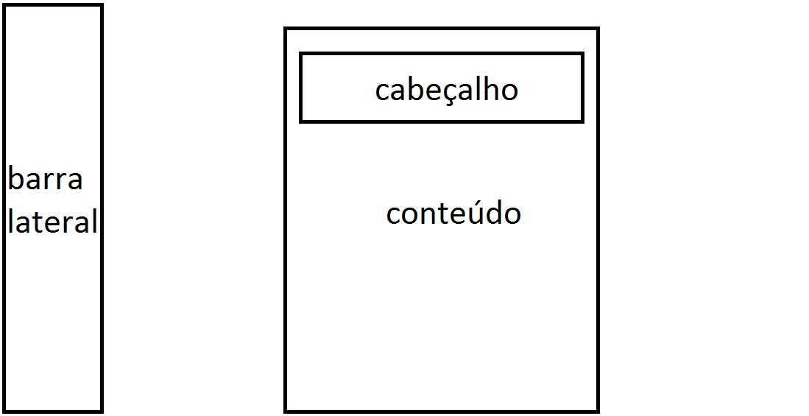
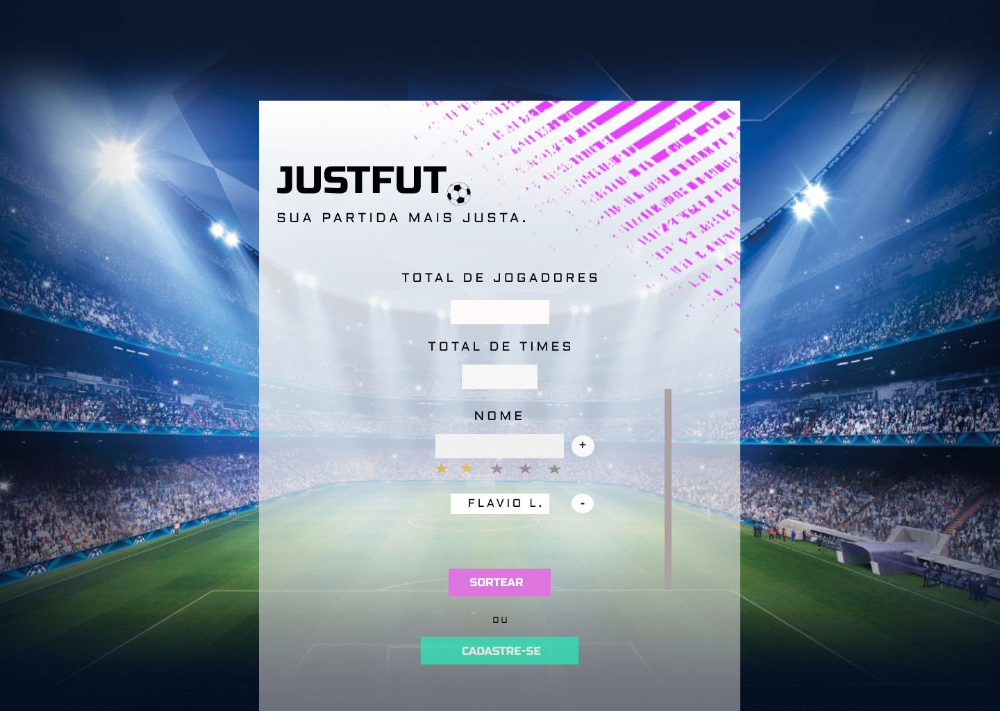
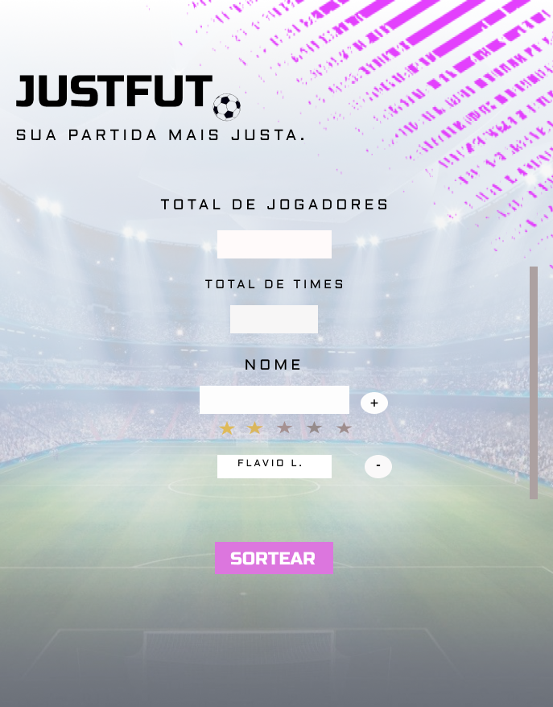

# Template padrão do site

O  padrão de layout a ser utilizado pelo site tem correspondência ao projeto de Interface elaborado anteriormente, conforme a Figura 1.

  

Figura 1 - Template do site

O template criado está disponivel <a href="https://github.com/ICEI-PUC-Minas-PMV-ADS/pmv-ads-2021-1-e1-proj-web-t2-justfut/blob/main/docs/4-Projeto%20de%20Interface.md">aqui</a>, e é composto pelos seguintes layouts:

● Tela principal

● Menu de configurações

● Formulário

# Tela principal
Tela que abrange a logo e slogan do site, formulário, botões de sorteio e cadastro, conforme a Figura 2.

  

Figura 2 - Tela Inicial

# Menu de configurações
Esse layout é utilizado para exibir as possibilidades de configurações do usuário, conforme a Figura 3.

  

Figura 3 - Menu

# Formulário
Local onde será exibido os dados inseridos pelo usuário e histórico de partidas, conforme a Figura 4.

  

Figura 4 - Formulário

